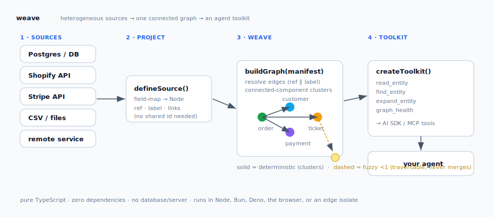
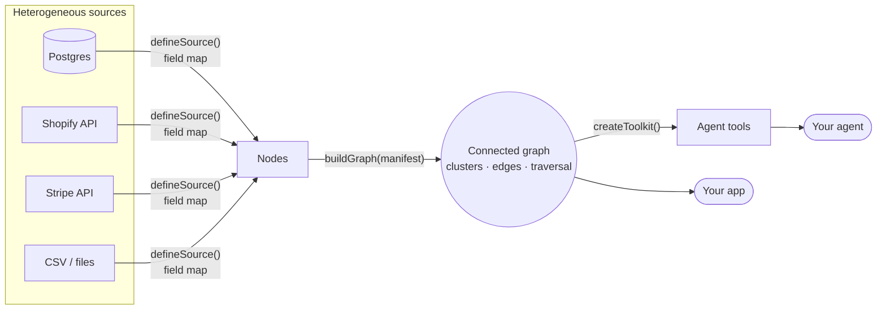

# weave

**Stitch records from many heterogeneous sources — databases, APIs, files, remote services — into one connected graph your code and your agents can read as a single thing.**

Pure TypeScript. Zero dependencies. No database, no server, no graph store. It runs anywhere JS runs — Node, Bun, Deno, the browser, a Cloudflare Worker isolate. A few config steps and your graph is ready.

```bash
npm install @shashwatjain511/weave
```



---

## Why

An agent today reads a business through a pile of disconnected tools — one per source. It calls `get_order`, `get_payment`, `get_ticket`, `get_shipment`, and gets back four blobs of JSON with no idea that they're the *same transaction*. The relationships — the part that actually answers questions — live only in someone's head.

The systems rarely share an id scheme. Shopify has its order id; Stripe references the order *number*; the support tool knows the customer's *email*; the catalog speaks *SKU*. Joining them is fiddly, repetitive, and easy to get wrong (one bad join and two customers merge into one).

**weave** is the small engine that does that join, declaratively:



You describe **where records come from** (a source) and **how types connect** (a manifest). weave resolves the edges, finds the connected components, and hands you a graph — plus a ready-made agent toolkit whose tool descriptions are generated from *your* manifest.

## Quickstart — three steps

**1. Shape your records into nodes.** A source is a declarative field-map; each field is a property name or an accessor. You fetch the records however you like (Drizzle, `fetch`, `fs`) and hand them over.

```ts
import { defineSource } from "@shashwatjain511/weave";

const orders = defineSource<OrderRow>({
  type: "order",
  provider: "shopify",
  id: "id",                       // → ref "order:shopify:<id>"
  label: "number",                // a human number an edge can resolve TO
  amount: "total",
  links: { customerEmail: "email" }, // outgoing foreign keys
});

const payments = defineSource<PaymentRow>({
  type: "payment",
  provider: "stripe",
  id: "id",
  links: { orderRefs: "orderNumber" }, // references the order's NUMBER, not its id
});
```

**2. Declare how the types connect** — plain data, not code:

```ts
import { defineManifest } from "@shashwatjain511/weave";

const manifest = defineManifest([
  { from: "order",   to: "customer", relation: "placed_by", sourceField: "customerEmail", confidence: 1 },
  { from: "payment", to: "order",    relation: "settles",   sourceField: "orderRefs",     confidence: 1 },
]);
```

**3. Weave and read.**

```ts
import { weave, readEntity } from "@shashwatjain511/weave";

const graph = weave(
  [
    { source: orders,   records: orderRows },
    { source: payments, records: paymentRows },
  ],
  manifest,
);

readEntity(graph, "#1001", { type: "order" });
// → { seed, related: { customer:[…], payment:[…] }, edges:[…] }
//   one entity + everything linked to it, across every source, as one object.
```

That's it. No infrastructure was stood up.

## Generate an agent toolkit

`createToolkit` turns the graph into a handful of framework-neutral tools whose descriptions name *your* node types and relations, so a model knows exactly what it can read and how things connect.

```ts
import { createToolkit } from "@shashwatjain511/weave";

const tools = createToolkit(graph, manifest);
// → read_entity · find_entity · expand_entity · graph_health
```

Each tool is `{ name, description, parameters (JSON Schema), execute }` — a shape that maps 1:1 onto the [Vercel AI SDK](https://sdk.vercel.ai)'s `tool()`, an MCP tool, or your own dispatcher:

```ts
import { tool } from "ai";
const aiTools = Object.fromEntries(
  tools.map((t) => [t.name, tool({ description: t.description, inputSchema: t.parameters, execute: t.execute })]),
);
```

Pass `() => graph` instead of a static graph if your data refreshes between calls.

## Repair the graph — detect → propose → commit

The four tools above are read-only. Give `createToolkit` an `onTuneEdge` **persistence sink** and it additionally emits two tools that turn the graph into a *detect → propose → repair* loop — without weave ever owning storage:

```ts
const tools = createToolkit(graph, manifest, {
  identityTypes: ["customer"],            // unique-entity types (powers identity_collision)
  // The sink: weave hands you a VALIDATED EdgeRule; you persist it however you like
  // (a config row, a KV value, a weave.edge.* JSON blob) and report the outcome.
  onTuneEdge: async (edge) => {
    await db.put(`weave.edge.${edge.relation}`, edge);
    return { committed: true };
  },
});
// → read_entity · find_entity · expand_entity · graph_health · tune_edge · diagnose
```

- **`diagnose`** runs the same invariant checks as `graph_health` and returns each finding **enriched with a remedy**. A finding carries a ready-to-commit `edgeFact` only when *simulating* that fix — rebuild with the rule demoted (preserving non-manifest `extraEdges`), re-check the invariants — provably clears it, so a collision actually caused by an `extraEdges` edge is never "fixed" by a no-op demotion. Findings an additive edge-fact can't honestly fix (`duplicate_ref` = dedupe at projection, `edge_dangling_endpoint` = a stale/unloaded reference, or an unattributable collision) come back as `advisory` guidance with no `edgeFact`.
- **`tune_edge`** takes an edge proposal, **validates it via `parseStoredEdge`** (rejecting confidence outside `(0, 1]` and unknown node types) *before* calling your sink, then persists it. The fact does **not** mutate the live in-memory graph — it merges into the manifest on the **next build** via `manifestOverrideFromConfig` → `mergeManifest`. Use it to add a missing join, or to demote an over-eager deterministic rule (re-propose the same `from/to/relation/sourceField` with a lower confidence — `mergeManifest` overrides by that key).

`diagnose` proposes, `tune_edge` commits: hand a finding's `edgeFact` straight to `tune_edge`. When `onTuneEdge` is **absent**, `createToolkit` returns exactly the four read-only tools — existing consumers are unaffected.

## Coverage — graphs over sources that fail

A woven graph is only as complete as the reads that fed it, and real heterogeneous sources fail: APIs rate-limit, DBs time out, list endpoints cap at N rows. A graph built from partial inputs **lies by omission** — an invoice looks orphaned, a count looks small, when the truth is "the orders read failed". Coverage makes that distinction first-class. Report how each source read went, and health, diagnose, and the toolkit interpret the graph *through* it:

```ts
const coverage: SourceCoverage[] = [
  { source: "shopify.orders",  types: ["order"],   swept: true, count: 412 },
  { source: "zoho.invoices",   types: ["invoice"], swept: true, count: 0,
    errors: ["HTTP 400: too many requests"] },              // failed → graph is partial
  { source: "zoho.payments",   types: ["payment"], swept: false },  // skipped by design → fine
];

const health = graphHealth(graph, { coverage });
health.coverageComplete;   // false — an attempted leg came back impaired
health.invariants;         // includes { code: "source_error", source: "zoho.invoices", … }
```

Give `createToolkit` the coverage plus an `onResweep` **executor** and the loop closes at runtime — the agent can *fix* the class of breakage that actually happens in production, not just report it:

```ts
const tools = createToolkit(graph, manifest, {
  coverage: () => latestSweep.coverage,       // live, alongside a live graph
  onResweep: async ({ source }) => {          // you own what "re-sweep" means:
    const outcome = await resweepLeg(source); // re-fetch that leg, rebuild, refresh caches
    return { ok: outcome.complete, note: outcome.summary };
  },
});
// → … · graph_health · diagnose · resweep_source
```

- **`diagnose`** now folds coverage findings (`source_error` / `source_truncated`) into the same findings channel as the structural invariants, each carrying a committable `resweepTarget`. It also **attributes** structural findings: a dangling reference whose node type is fed by an impaired leg is reported as a *coverage artifact* ("the read failed") rather than a stale reference to hand-review.
- **`resweep_source`** hands a failed leg's id back to your executor. Re-sweeping only re-runs *reads*, so it needs no write-approval gate — an agent can heal a rate-limited graph unattended, then `diagnose` again to verify.
- No coverage report → everything behaves exactly as before; `coverage`/`coverageComplete` simply don't appear.

The rule of thumb: **`tune_edge` repairs the *grammar*** (a join that's wrong for this deployment), **`resweep_source` repairs the *data*** (a read that failed this sweep). Both are proposed by the same `diagnose`.

## Wire it with a coding agent

weave ships an **agent skill** at [`skills/weave/SKILL.md`](skills/weave/SKILL.md). Point a coding agent (Claude Code, etc.) at it and it will inventory your sources, write the `defineSource`s + manifest against your real schema, verify the joins with `graphHealth`, and wire the toolkit into your agent framework — applying the one modeling rule (deterministic vs. fuzzy edges) so you don't false-merge.

```bash
# make it discoverable to your agent (Claude Code example)
mkdir -p .claude/skills/weave
cp node_modules/@shashwatjain511/weave/skills/weave/SKILL.md .claude/skills/weave/
```

Then ask: *"wire weave onto my Postgres orders + Stripe payments."*

## How it works (the ideas worth knowing)

- **Nodes are source-blind.** Every record becomes a `Node` with a URN `ref` (`<type>:<provider>:<id>`), a human `label`, and a `links` map of outgoing foreign keys. The original record rides along as `raw`.
- **Edges resolve by normalized ref *or* label.** `#1001`, `1001`, and `SO-1001`-style mismatches between systems are matched after a trim / lowercase / `#`-strip. So Stripe pointing at an order *number* still binds to the Shopify order *node*.
- **Clusters are connected components over *deterministic* edges only.** A cluster ≈ one real-world thing — a transaction, a customer's footprint. `readEntity` / `clusterOf` return exactly that.
- **Confidence is first-class — the "black-hole" guard.** An edge at confidence < 1 (a fuzzy match, a shared dimension like a product catalog) is recorded for traversal but **never merges clusters**. One bad fuzzy match can't collapse your whole graph into a single blob. Feed verdicts from your own matcher/ML model as `extraEdges` with their true confidence and provenance.
- **Joins can be tuned at runtime, stored as data.** `manifestOverrideFromConfig` reads per-tenant/-deployment edge rules out of config records and `mergeManifest`s them onto your shipped default — retune one hop without forking the grammar. Stored rules can't introduce new node types (the guardrail).
- **Health is a pure report.** `graphHealth` gives counts by type/relation, the cluster-size distribution, isolated nodes, fuzzy-edge count, and structural invariants (`duplicate_ref`, `edge_dangling_endpoint`, and an optional `identity_collision` for the types you name as unique identities).

## Diagnostics — see *why* a join didn't draw

`buildGraph` is deterministic but quiet: an edge that doesn't resolve simply isn't there. When you're wiring a new source or chasing a missing link, the **diagnostics layer** (`compile.ts`) tells you what the builder saw — without re-implementing matching. It runs the *same* projection and link-resolution pass `buildGraph` uses, so an "unresolved" link reported here is exactly an edge the builder couldn't draw, never a divergent second opinion.

```ts
import { compileGraph } from "@shashwatjain511/weave";

const { graph, nodes, diagnostics } = compileGraph(
  [
    { source: orders,   records: orderRows },
    { source: payments, records: paymentRows },
  ],
  manifest,
);
```

`compileGraph` returns the built `graph`, the projected `nodes`, and a `diagnostics` report:

- **`sourceCounts`** — per source: `nodeCount` and `nodesByType` (plus the source `kind`). Did each adapter actually project what you expected?
- **`nodesByType`** — the global node-type histogram across all sources.
- **`duplicateRefs`** — refs projected more than once (two records collapsed to the same `<type>:<provider>:<id>` URN). A non-empty list usually means a wrong `id` selector.
- **`unresolvedLinks`** — every link value that matched *no* target node, with the `from` ref, `fromType`, `source` provenance, the `relation` / `sourceField` / `targetType` it tried, and the literal `value` that missed. This is your "why isn't this edge here?" answer — a typo'd key, a normalization gap, or a target node that was never loaded. Bounded by `maxUnresolvedLinks` (default 50) so a broken join can't flood the report.

Reach for the pieces directly when you don't need the whole bundle: `projectSourceInputs(inputs)` to just get the nodes, or `diagnoseGraphInputs(nodes, manifest, opts?)` to diagnose nodes you projected yourself. All pure — records in, report out; no I/O.

## What weave is *not*

- **Not a probabilistic entity-resolution / ML matcher.** weave does deterministic joins and *records* confidence-weighted edges; it doesn't train a model to guess fuzzy matches. Bring your own matcher (e.g. [Splink](https://github.com/moj-analytical-services/splink)) and feed its verdicts as `extraEdges`. weave is the substrate, not the matcher.
- **Not a graph database.** It builds an in-memory graph from records you already have. No persistence, no query language, no server. (Persist your *source data* and rebuild — the build is pure and fast.)
- **Not an ETL / warehouse pipeline.** No syncing, no schedules. You fetch; weave joins.

If you need RDF/SPARQL, federation at petabyte scale, or a standing graph server, reach for those. weave is for the common, underserved case: *"I have records from a few systems and I want them as one connected, traversable thing — in process, right now."*

## Example

A runnable five-source sample (Shopify orders, Stripe payments, Zendesk tickets, Shiprocket shipments, an app-DB customer directory) lives in [`examples/agent-360`](examples/agent-360). It weaves them, prints health, shows the generated toolkit, and has an agent read one order's entire footprint across all five.

```bash
npx tsx examples/agent-360/run.ts
```

## API

| Export | What it does |
| --- | --- |
| `defineSource(config)` | Declarative record → node mapping. `.project(records)`. |
| `defineManifest(edges, extraTypes?)` | Build a manifest, inferring node types from the edges. |
| `mergeManifest(base, override?)` | Overlay tuned edges onto a base manifest. |
| `weave(inputs, manifest, opts?)` | Project every source and build the graph in one call. |
| `buildGraph(nodes, manifest, opts?)` | The core builder (use directly if you project nodes yourself). |
| `readEntity(graph, seed, opts?)` | One entity + its whole cluster, grouped by type — the agent read. |
| `clusterOf(graph, ref)` / `expand(graph, ref, opts?)` | Cluster membership / bounded traversal. |
| `createToolkit(graph, manifest, opts?)` | Generate `read_entity` / `find_entity` / `expand_entity` / `graph_health` tools — plus `tune_edge` / `diagnose` when `opts.onTuneEdge` is given. |
| `graphHealth(graph, opts?)` / `checkGraphInvariants(...)` | Pure health report + structural invariants. |
| `compileGraph(inputs, manifest, opts?)` | Build the graph *and* a diagnostics report (source counts, duplicate refs, unresolved links). |
| `diagnoseGraphInputs(nodes, manifest, opts?)` / `projectSourceInputs(inputs)` | Diagnose pre-projected nodes / just project sources to nodes. |
| `manifestOverrideFromConfig(records, base, prefix?)` | Read runtime-tuned edges from stored config. |

## License

MIT.
