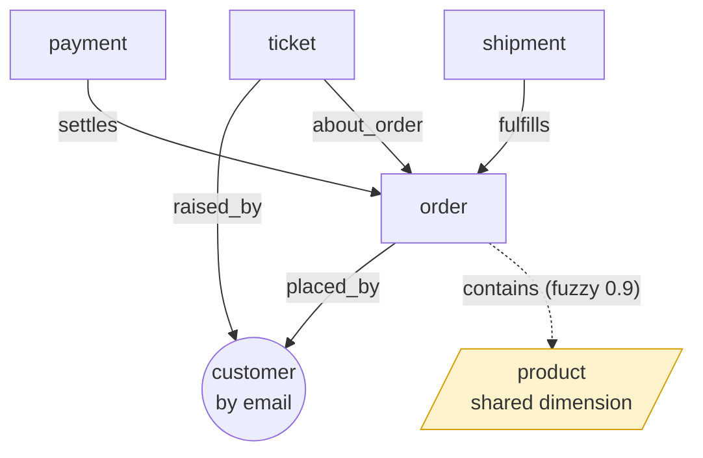

# Example: agent 360 across five systems

A tiny e-commerce business whose data lives in five systems that **share no id scheme** — they only agree on human things (an email, an order number, a SKU). This example weaves them into one graph and has an agent read a single order's entire footprint across all of them.

```bash
npx tsx examples/agent-360/run.ts   # from the package root
```

## The sources

| System | Node type | Keyed by | Points at |
| --- | --- | --- | --- |
| App DB | `customer` | email | — |
| Shopify | `order` | order id | customer (email), products (SKU) |
| Stripe | `payment` | charge id | order (**number**) |
| Zendesk | `ticket` | ticket id | customer (email), order (number) |
| Shiprocket | `shipment` | AWB | order (number) |
| Catalog | `product` | SKU | — |

## How they connect (the manifest)



Solid arrows are **deterministic** (confidence 1) — they form clusters. The dotted arrow to `product` is **fuzzy** (0.9) on purpose: read on.

## What the agent gets

`read_entity("#1001")` returns Ada's order stitched to her customer record, its Stripe payment, its Shiprocket shipment, and the Zendesk ticket about it — and **only Ada's world**. Bob is a separate cluster. Four systems, one read, no shared id between them.

## The gotcha worth learning: shared dimensions

A `product` is **shared reference data** — the same SKU appears in many customers' orders. If `order —contains→ product` were deterministic, that shared product would union Ada's and Bob's orders into one cluster (a false merge — and the `identity_collision` invariant would fire, because two `customer` nodes would share a cluster).

So `contains` is declared at **confidence 0.9**: the edge is recorded and fully traversable (`expand_entity` walks it to reach the products), but it **never merges clusters**. This is the fuzzy "black-hole" guard — the single most important modeling rule in weave:

> Link through shared dimensions (catalogs, tags, categories, addresses) with confidence < 1. Reserve confidence 1 for edges that define *one real-world thing*.
